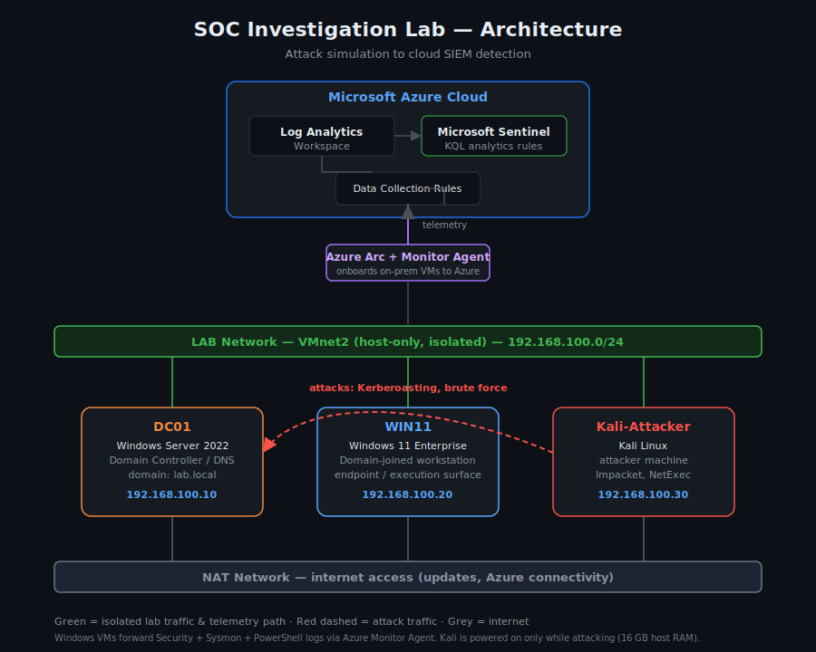

# SOC Investigation Lab

A hands-on detection engineering lab demonstrating blue-team skills: attack simulation, detection authoring, incident investigation, and MITRE ATT&CK mapping.

## Architecture

- **SIEM:** Microsoft Sentinel (Log Analytics workspace)
- **Endpoints:** Windows Server 2022 domain controller + Windows 11 domain-joined workstation (VMware Workstation)
- **Telemetry:** Sysmon (SwiftOnSecurity config), PowerShell script-block logging, and Windows Security events, forwarded to Sentinel via Azure Monitor Agent over Azure Arc
- **Detections:** Custom KQL scheduled analytics rules

## Lessons Learned
- Root-caused a complete loss of guest VM internet to a VMware host-only subnet (192.168.10.0/24) colliding with the physical home router at 192.168.10.1, which poisoned NAT return traffic on the host. Re-subnetting the lab network to 192.168.100.0/24 resolved it. Ruled out DNS, duplicate MAC, and firewall first.

## Detections
| # | Name | Tactic | Technique |
|---|------|--------|-----------|
| 01 | New Account Created and Promoted to Admin | Persistence, Privilege Escalation | T1136.001, T1098 |
| 02 | Encoded PowerShell Execution | Execution | T1059.001 |
| 03 | Security Log Cleared | Defense Evasion | T1070.001 |
| 04 | Brute Force (Multiple Failed Logons) | Credential Access | T1110 |
| 05 | Kerberoasting (Service Ticket RC4 Request) | Credential Access | T1558.003 |

These five detections are the complete detection set for this lab, spanning endpoint execution, defense evasion, persistence/privilege escalation, and identity/credential attacks. See the [coverage matrix](coverage-matrix.md) for full detail and the project roadmap.

## Incident Reports

Full investigation writeups demonstrating end-to-end triage of detected incidents: timeline reconstruction, evidence analysis, threat assessment, and response recommendations.

- [01 – Kerberoasting Investigation](incident-reports/01-kerberoasting-investigation.md)
- [02 – Brute Force Investigation](incident-reports/02-brute-force-investigation.md)
- [03 – Encoded PowerShell Investigation](incident-reports/03-encoded-powershell-investigation.md)
- [04 – Security Log Cleared Investigation](incident-reports/04-security-log-cleared-investigation.md)
- [05 – New Admin Account Investigation](incident-reports/05-new-admin-account-investigation.md)

## Documentation

- [Project Overview](docs/project-overview.md) – complete walkthrough of the environment, networking, telemetry pipeline, and methodology
- [Coverage Matrix](coverage-matrix.md) – detections mapped to MITRE ATT&CK, plus roadmap
