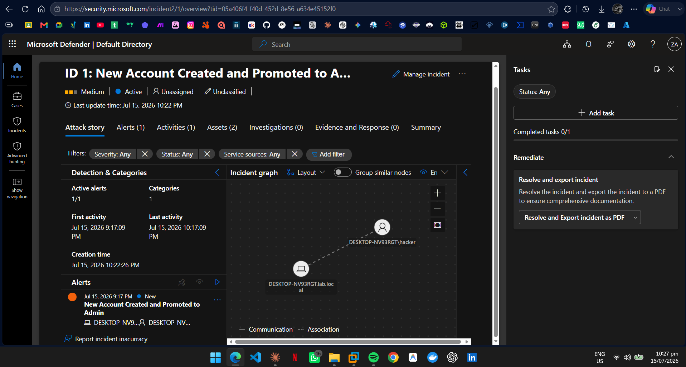

# Detection 01: New Account Created and Promoted to Admin

## Summary
Detects a local or domain account that is created and then added to a privileged group (Administrators, Domain Admins, Enterprise Admins) within 5 minutes. This rapid create-then-elevate sequence is a common attacker technique for establishing persistence and escalating privilege after gaining initial access.

## MITRE ATT&CK
| Tactic | Technique |
|--------|-----------|
| Persistence | T1136.001 – Create Account: Local Account |
| Privilege Escalation | T1098 – Account Manipulation |

## Data Sources
- Windows Security Event Log (via Azure Monitor Agent to Microsoft Sentinel)
- Event ID 4720 – A user account was created
- Event ID 4732 – A member was added to a security-enabled local group

## Detection Logic
​```kql
SecurityEvent
| where EventID == 4720
| project AccountCreatedTime = TimeGenerated, NewAccount = TargetAccount, Creator = SubjectAccount, Computer
| join kind=inner (
    SecurityEvent
    | where EventID == 4732
    | where TargetUserName in ("Administrators", "Domain Admins", "Enterprise Admins")
    | project AdminAddTime = TimeGenerated, GroupAddedTo = TargetUserName, Computer
) on Computer
| where AdminAddTime - AccountCreatedTime between (0min .. 5min)
| project AccountCreatedTime, NewAccount, Creator, AdminAddTime, GroupAddedTo, Computer
​```

The rule correlates Event 4720 and 4732 on the same host within a 5-minute window. Correlation is the point: account creation alone is normal (onboarding), and admin group changes alone are normal (role changes). The two happening back-to-back is the anomaly.

## False Positives
- Automated IT provisioning that creates and immediately privileges accounts. Tune by allow-listing known provisioning hosts or service accounts.
- Initial domain or lab setup produces benign hits.

## Tuning Notes
- The first version fired twice per attack because Event 4732 logs both the Administrators and Users group additions. Filtered `TargetUserName` to privileged groups only, removing the duplicate.
- Future improvement: exclude the built-in Administrator SID and documented service accounts.

## Validation
Simulated by creating a local account and adding it to Administrators:
​```cmd
net user hacker Passw0rd! /add
net localgroup administrators hacker /add
​```
The rule fired and generated Incident ID 1 in Microsoft Sentinel / Defender XDR.



## Response Runbook
1. Confirm whether the account creation was authorized (check change tickets).
2. Identify the Creator account. Was it compromised?
3. Disable the new account if unauthorized.
4. Review the Creator's recent activity for lateral movement.
5. Check the host for other recently created accounts.
