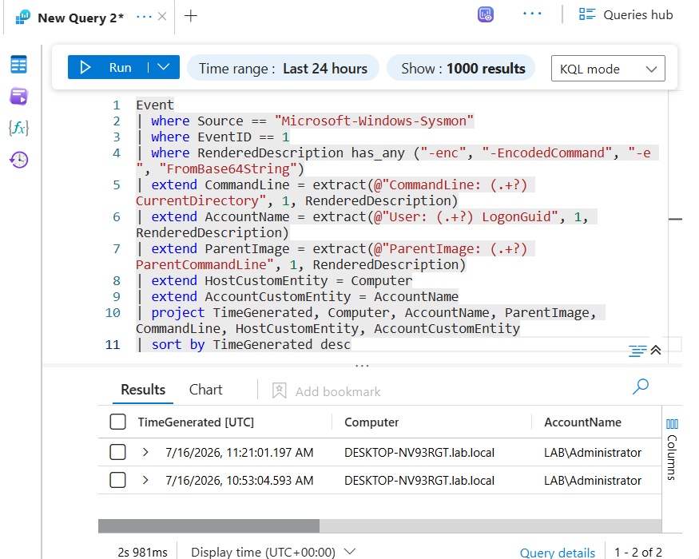
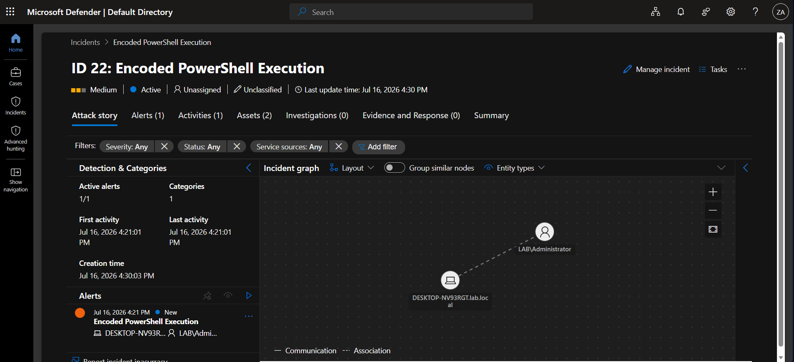

# Detection 02: Encoded PowerShell Execution

## Summary
Detects PowerShell launched with an encoded command (`-enc`, `-EncodedCommand`) or inline base64 decoding (`FromBase64String`). Attackers encode PowerShell to hide the actual command from casual inspection and to bypass simple string-based controls. This detection flags the encoding technique itself, which is a high-signal indicator of scripted or hands-on-keyboard activity when it appears outside known automation.

## MITRE ATT&CK
| Tactic | Technique |
|--------|-----------|
| Execution | T1059.001 – Command and Scripting Interpreter: PowerShell |

## Data Sources
- Sysmon (SwiftOnSecurity config) via Azure Monitor Agent to Microsoft Sentinel
- Sysmon Event ID 1 – Process Create
- Key field: the `CommandLine` value inside the event, which contains the `-enc` flag and the base64 payload

## Detection Logic
```kql
Event
| where Source == "Microsoft-Windows-Sysmon"
| where EventID == 1
| where RenderedDescription has_any ("-enc", "-EncodedCommand", "-e ", "FromBase64String")
| extend CommandLine = extract(@"CommandLine: (.+?) CurrentDirectory", 1, RenderedDescription)
| extend AccountName = extract(@"User: (.+?) LogonGuid", 1, RenderedDescription)
| extend ParentImage = extract(@"ParentImage: (.+?) ParentCommandLine", 1, RenderedDescription)
| extend HostCustomEntity = Computer
| extend AccountCustomEntity = AccountName
| project TimeGenerated, Computer, AccountName, ParentImage, CommandLine, HostCustomEntity, AccountCustomEntity
| sort by TimeGenerated desc
```

The rule filters to Sysmon process-create events, matches the common encoded-PowerShell flags, and uses `extract` to pull the command line, user, and parent process out of the raw `RenderedDescription` blob into clean columns. `HostCustomEntity` and `AccountCustomEntity` map the host and account into the incident so they appear as pivotable entities.

Matched flags:
- `-enc` and `-EncodedCommand` are the standard encoded-command switches.
- `-e ` catches the shortened form, since PowerShell accepts truncated parameter names.
- `FromBase64String` catches inline decode-and-execute patterns that do not use the `-enc` switch.

## False Positives
This is a broad detection and will produce false positives in a real environment. Encoded PowerShell is used legitimately by:
- Software installers and management agents
- Group Policy startup and logon scripts
- Configuration management tooling

Encoding is an obfuscation method, not proof of malice. On its own, one `-enc` alert is low-confidence and needs analyst triage.

## Tuning Notes
Current version is intentionally broad to guarantee detection. Tuning steps for production:
- Allowlist known automation hosts and signed service accounts that routinely run encoded PowerShell.
- Baseline normal encoded-PowerShell usage per host before enabling as a high-priority rule.
- Exclude expected parent processes (for example, known agent executables).

Planned enhancement: decode the base64 payload inside KQL and alert on suspicious *intent* rather than the `-enc` flag alone. Decoding lets the rule key on high-risk content such as `DownloadString`, `IEX`, `-nop`, `-w hidden`, or nested `FromBase64String`. This lowers false positives substantially. Tradeoff: more complex query and it can miss novel obfuscation, so the broad version is kept as a safety net.

## Validation
Simulated on WIN11 by encoding a benign command and running it with `-enc`:
```powershell
$cmd = 'Write-Output "kerberoast simulation"'
$enc = [Convert]::ToBase64String([Text.Encoding]::Unicode.GetBytes($cmd))
powershell.exe -enc <encoded_string>
```
Sysmon Event 1 captured the process create with the full encoded command line. The scheduled analytics rule fired and generated **Incident ID 22** in Microsoft Sentinel / Defender XDR, with the host (DESKTOP-NV93RGT) and account (LAB\Administrator) correctly mapped as entities.





## Response Runbook
1. Decode the base64 command line to see what actually ran.
2. Assess intent. Is the decoded command downloading, executing in memory, or hiding a window?
3. Identify the account and host. Is the activity expected for that user?
4. Check the parent process. Was PowerShell spawned by something suspicious (Office app, script host, unknown binary)?
5. If malicious, isolate the host, disable the account, and pull related process and network telemetry for the same time window.
6. If benign automation, document the source and add it to the allowlist to tune the rule.
