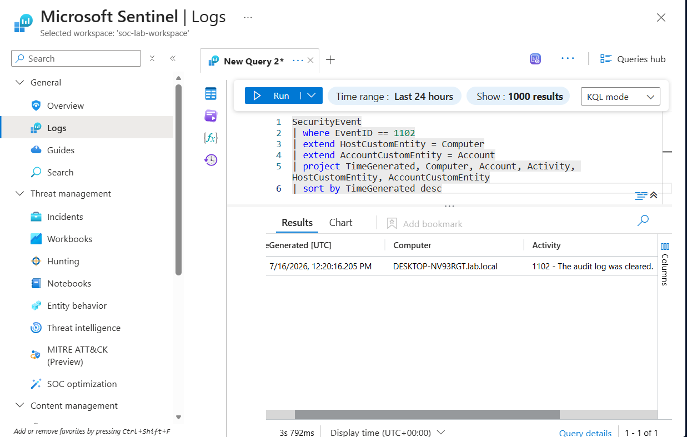
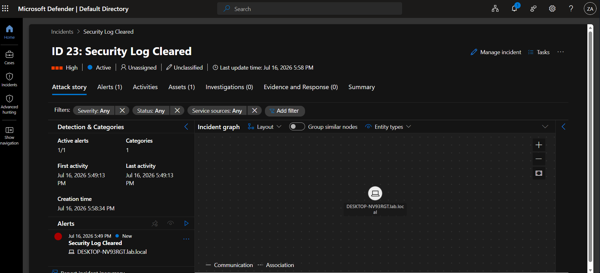

# Detection 03: Security Log Cleared

## Summary
Detects clearing of the Windows Security event log (Event ID 1102). Clearing the audit log is a deliberate anti-forensic action used to destroy evidence of prior activity. There is almost no legitimate reason to clear the Security log on a normal endpoint, which makes this one of the highest-fidelity detections in the lab. The act of clearing the log generates Event 1102 itself, so it cannot be done silently.

## MITRE ATT&CK
| Tactic | Technique |
|--------|-----------|
| Defense Evasion | T1070.001 – Indicator Removal: Clear Windows Event Logs |

## Data Sources
- Windows Security Event Log (via Azure Monitor Agent to Microsoft Sentinel)
- Event ID 1102 – The audit log was cleared

## Detection Logic
```kql
SecurityEvent
| where EventID == 1102
| extend HostCustomEntity = Computer
| extend AccountCustomEntity = Account
| project TimeGenerated, Computer, Account, Activity, HostCustomEntity, AccountCustomEntity
| sort by TimeGenerated desc
```

The rule matches on Event ID 1102 directly. No correlation or parsing needed, since the event itself is the indicator. `HostCustomEntity` and `AccountCustomEntity` map the host and the account that cleared the log into the incident as pivotable entities.

## False Positives
Very low. Clearing the Security log is rare in normal operations. The main benign sources are:
- Administrators intentionally clearing logs during maintenance or troubleshooting.
- Log management or SIEM-forwarding tooling that rotates and clears local logs by design.

Even these are worth reviewing, because a legitimate clear and a malicious clear look identical in the event. The value of this detection is that it forces a human to confirm the clear was authorized.

## Tuning Notes
- Because false positives are rare and the impact of a missed detection is high, this rule is set to **High** severity and left broad. Suppressing it risks missing real evidence destruction.
- If a specific host or account clears logs on a known schedule (for example, a log-rotation service account), allowlist that specific pairing rather than weakening the rule globally.

## Validation
Simulated on WIN11 by clearing the Security log from an elevated prompt:
```cmd
wevtutil cl Security
```
Event 1102 was written and forwarded to Sentinel. The scheduled analytics rule fired and generated **Incident ID 23** in Microsoft Sentinel / Defender XDR, with the host (DESKTOP-NV93RGT) and account correctly mapped as entities.





## Response Runbook
1. Confirm whether the log clear was authorized. Check change tickets and ask the responsible admin.
2. Identify the account that cleared the log and the host it happened on.
3. If unauthorized, treat as active evidence destruction. Assume the host is compromised.
4. Pull any log data already forwarded to the SIEM before the clear, since Sentinel retains what was sent even after the local log is wiped.
5. Investigate activity on the host in the window before the clear, using the centralized telemetry the attacker could not reach.
6. Isolate the host and disable the account if compromise is confirmed.
