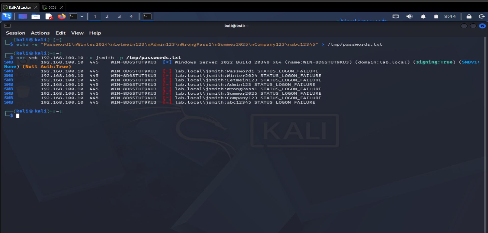
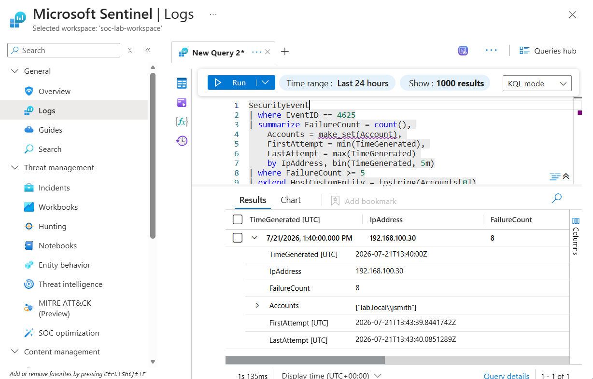
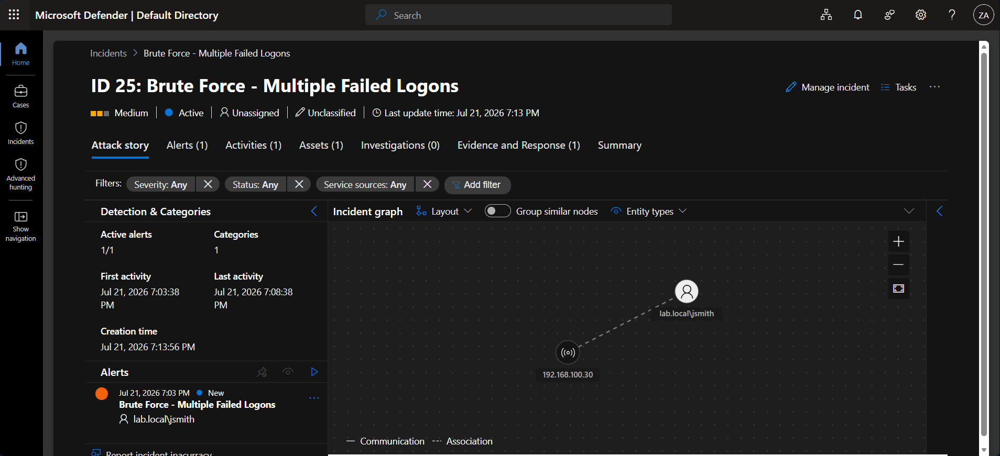

# Detection 04: Brute Force (Multiple Failed Logons)

## Summary
Detects a password brute-force or spray attack: five or more failed logon attempts (Event 4625) from a single source IP within a five-minute window. A single failed logon is normal (mistyped passwords happen constantly). The attack signature is volume from one source in a short time. This detection keys on that pattern rather than on any individual failure, and it surfaces the attacker's source IP so the origin of the attack is immediately visible.

## MITRE ATT&CK
| Tactic | Technique |
|--------|-----------|
| Credential Access | T1110 – Brute Force |

## Data Sources
- Windows Security Event Log (Domain Controller) via Azure Monitor Agent to Microsoft Sentinel
- Event ID 4625 – An account failed to log on
- Key fields: Account (target), IpAddress (source), LogonType

## Detection Logic
```kql
SecurityEvent
| where EventID == 4625
| summarize FailureCount = count(),
    TargetedAccounts = make_set(Account),
    FirstAttempt = min(TimeGenerated),
    LastAttempt = max(TimeGenerated)
    by IpAddress
| where FailureCount >= 5
| extend AccountCustomEntity = tostring(TargetedAccounts[0])
| extend IPCustomEntity = IpAddress
| project IpAddress, FailureCount, TargetedAccounts, FirstAttempt, LastAttempt, AccountCustomEntity, IPCustomEntity
| sort by FailureCount desc
```

The rule aggregates failed logons by source IP and counts them. When run as a scheduled rule with a five-minute lookback, the time window is handled by the schedule itself, so grouping by IP alone gives failures-per-source-per-five-minutes. The `FailureCount >= 5` threshold is the core of the detection: it separates a brute-force burst from the routine one-off failures that occur across any domain. The rule also captures which accounts were targeted and the first and last attempt times, giving an analyst the shape of the attack at a glance.

The source IP is mapped as an entity, which is the key investigative pivot for a brute force: it points directly at the attacking host.

## False Positives
Brute force detections are more prone to false positives than most, because several benign conditions produce bursts of failed logons:
- A service account with a stale or expired password retrying automatically.
- A user whose saved credentials (mapped drives, cached app logins) are outdated after a password change.
- Misconfigured applications or scripts hammering authentication.

Because of this, the detection is set to **Medium** severity rather than High: it warrants investigation but is not an automatic emergency the way log clearing or Kerberoasting is. Most alerts will need analyst triage to separate a real attack from a misbehaving account.

## Tuning Notes
- The threshold of 5 failures in 5 minutes is a starting point. In a noisy production environment it may need raising, or pairing with additional conditions (for example, failures against many distinct accounts from one IP, which indicates password spraying rather than a single-account brute force).
- Allowlist known service-account source IPs that legitimately produce repeated failures while their credentials are being fixed.
- Future improvement: distinguish two sub-patterns and alert differently on each — many failures against one account (classic brute force) versus few failures each against many accounts (password spraying, which stays under per-account lockout thresholds).

## Validation
Executed from a Kali attacker VM (192.168.100.30) against the domain controller using NetExec, spraying a list of wrong passwords at a domain user (`jsmith`):
```bash
nxc smb 192.168.100.10 -u jsmith -p /tmp/passwords.txt
```
This produced eight failed logons in under a second, all from the same source IP. The detection query aggregated them into a single finding: source 192.168.100.30, 8 failures, targeting jsmith. The scheduled analytics rule fired and generated an incident in Microsoft Sentinel / Defender XDR, with the source IP and targeted account mapped as entities.







## Response Runbook
1. Identify the source IP. Does it map to a known workstation, a service host, or something unexpected/external? An unknown source is a strong signal.
2. Check the outcome. Were any of the attempts eventually successful (a 4624 success logon from the same IP/account right after the failures)? If so, treat as a likely compromise, not just an attempt.
3. Identify the targeted account(s). One account suggests targeted brute force; many accounts from one source suggests password spraying.
4. If the source is unexpected or a success followed the failures: disable or reset the affected account, block the source IP, and investigate the host.
5. If it is a benign service account with stale credentials: fix the account's stored password to stop the failures, and allowlist if appropriate.
6. Review whether account lockout policy is configured. A brute force that never triggers lockout may indicate the policy is missing or too permissive.
