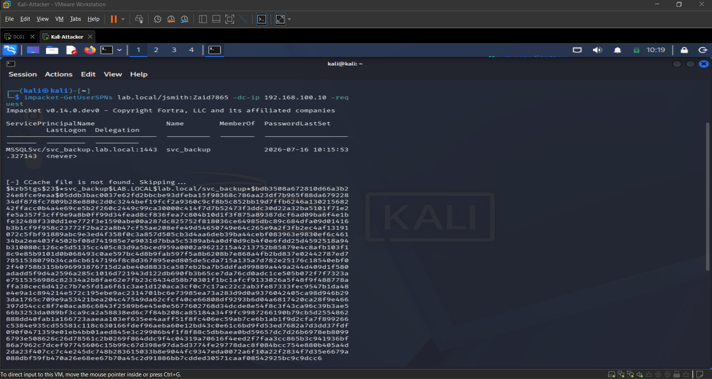
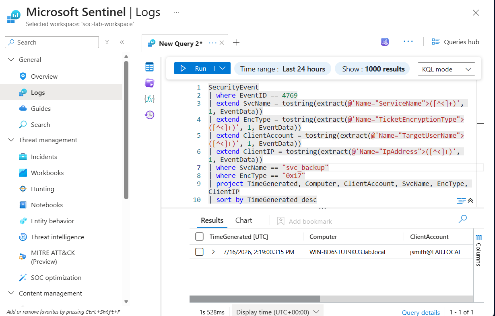
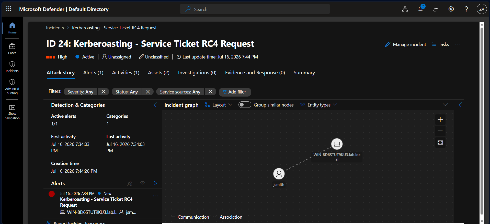

# Detection 05: Kerberoasting (Service Ticket RC4 Request)

## Summary
Detects a Kerberoasting attack: a Kerberos service ticket request (Event 4769) for a user service account, made with RC4 encryption (type 0x17). In Active Directory, any authenticated domain user can request a service ticket for any account that has a Service Principal Name (SPN). That ticket is encrypted with the service account's password hash. An attacker requests the ticket, extracts the hash, and cracks it offline to recover the service account password. Attackers force RC4 because it is far easier to crack than AES. A service-account ticket requested with RC4 is the core signature of this attack.

## MITRE ATT&CK
| Tactic | Technique |
|--------|-----------|
| Credential Access | T1558.003 – Steal or Forge Kerberos Tickets: Kerberoasting |

## Data Sources
- Windows Security Event Log (Domain Controller) via Azure Monitor Agent to Microsoft Sentinel
- Event ID 4769 – A Kerberos service ticket was requested
- Key fields (inside the EventData XML): ServiceName, TicketEncryptionType, TargetUserName, IpAddress

## Detection Logic
```kql
SecurityEvent
| where EventID == 4769
| extend SvcName = tostring(extract(@'Name="ServiceName">([^<]+)', 1, EventData))
| extend EncType = tostring(extract(@'Name="TicketEncryptionType">([^<]+)', 1, EventData))
| extend ClientAccount = tostring(extract(@'Name="TargetUserName">([^<]+)', 1, EventData))
| extend ClientIP = tostring(extract(@'Name="IpAddress">([^<]+)', 1, EventData))
| where EncType == "0x17"
| where SvcName !endswith "$"
| where ClientAccount !endswith "$"
| extend HostCustomEntity = Computer
| extend AccountCustomEntity = ClientAccount
| project TimeGenerated, Computer, ClientAccount, SvcName, EncType, ClientIP, HostCustomEntity, AccountCustomEntity
| sort by TimeGenerated desc
```

The 4769 fields live inside the `EventData` XML rather than as promoted columns, so the rule uses `extract` to pull ServiceName, encryption type, client account, and source IP out of the raw XML.

The detection logic rests on three filters:
- `EncType == "0x17"` isolates RC4-encrypted requests. Modern domains use AES (0x11/0x12) by default. RC4 on a ticket request is the anomaly Kerberoasting tools produce.
- `SvcName !endswith "$"` excludes machine-account services (computer accounts end in `$`), which legitimately request tickets with varied encryption and are the largest false-positive source.
- `ClientAccount !endswith "$"` excludes tickets requested by machine accounts, leaving user-initiated requests.

The point is signal isolation. Event 4769 fires constantly in normal AD operation. Alerting on 4769 alone would be useless. Filtering to an RC4 request for a user-account SPN separates the attack from the noise.

## False Positives
- Legacy applications or services that still negotiate RC4 can trigger this. These should be identified and either upgraded to AES or explicitly allowlisted.
- Environments with accounts configured for RC4-only can produce benign hits. Baseline which accounts legitimately use RC4 before enabling in production.

Even so, RC4 service-ticket requests are uncommon in a modern domain and each one is worth reviewing.

## Tuning Notes
- Set to **High** severity. Kerberoasting yields credentials that enable lateral movement and privilege escalation, so the impact of a real detection is high and the false-positive rate is low.
- The rule is written to catch roasting against **any** user service account, not just the lab's `svc_backup`, by keying on the RC4-plus-user-SPN pattern rather than a specific target name.
- Future improvement: add a threshold or aggregation to flag a single client requesting many distinct SPNs in a short window, which catches bulk roasting even where individual requests look ordinary. Correlating the source IP against known workstation ranges would further reduce noise.

## Validation
Executed from a Kali attacker VM (192.168.100.30) on the lab network, authenticating as a low-privilege domain user (`jsmith`) to roast the planted service account (`svc_backup`):
```bash
impacket-GetUserSPNs lab.local/jsmith:Zaid7865 -dc-ip 192.168.100.10 -request
```
The tool returned the crackable `$krb5tgs$23$` ticket hash (the `$23$` confirms RC4). On the domain controller this generated Event 4769 with ServiceName `svc_backup`, TicketEncryptionType `0x17`, client `jsmith@LAB.LOCAL`, and source IP `192.168.100.30` (the attacker). The scheduled analytics rule fired and generated **Incident ID 24** in Microsoft Sentinel / Defender XDR, with the host and account mapped as entities.







## Response Runbook
1. Confirm the source. The client IP in the event should map to a known workstation. An unexpected or server/attacker IP requesting service tickets is a strong signal.
2. Identify which service account (SPN) was targeted. Assume its password is now subject to offline cracking.
3. Reset the targeted service account password immediately, with a long, random password (25+ characters) to defeat cracking.
4. Investigate the client account that made the request. Was it compromised? Review its recent authentication and activity.
5. Check for additional roasting: look for the same client requesting other SPNs, or other RC4 4769 events around the same time.
6. Longer term, move service accounts to AES-only or Group Managed Service Accounts (gMSA) to remove the RC4 attack surface entirely.
